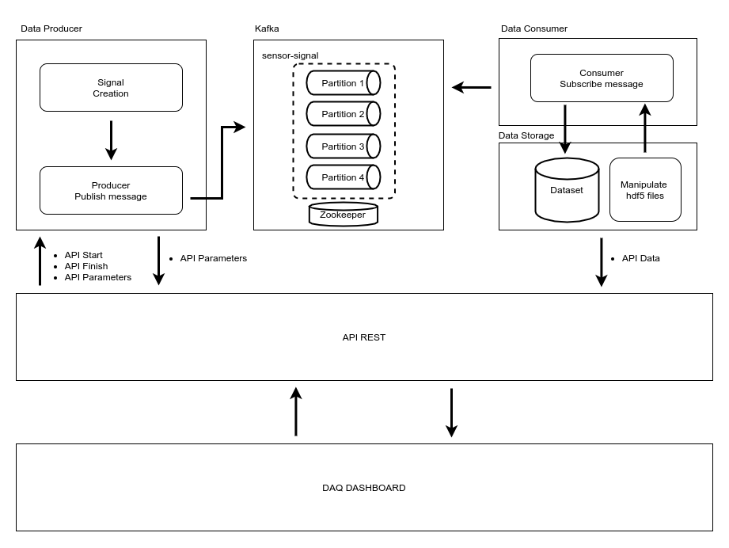
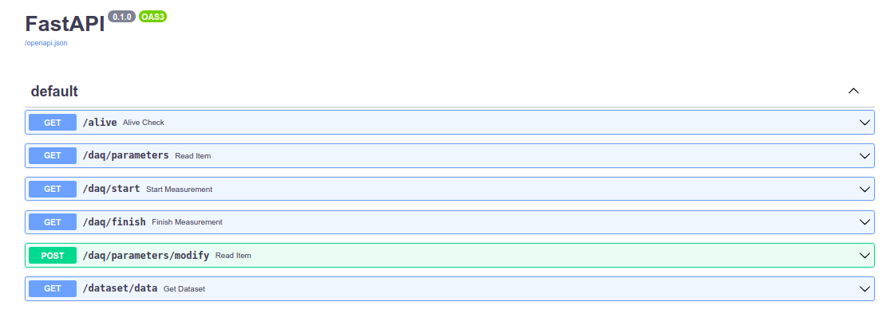

# MAIN GOAL

Construct a DAQ dashboard using kafka, plotlydashboard, API rest and HDF5 files as database.

# SERVICE ORGANIZATION




# CODE ORGANIZATION

```
|-application_settings
| |-docker-compose.yml: stores docker settings from kafka and zookepper
| |-requirements.txt: requirements needed to run the application
|
|-data_consumer
| |-consumer: module responsible for consuming the messages
|
|-data_producer
| |-signal
| |  |-producer_parameters.json: parameters needed to generate the signal
| |  |-signal_generator: module dedicated to create the signal
| |-producer: responsible for creating the message with the signal
|
|-data_storage
| |-manipulate_hdf5.py: responsible for manipulate the database
| |-measurements.hdf5: database
|
|-tests
| |-test_api.py: contain the api rest test 
|
|-main.py: API Rest definitions
|
|-makefile: Several cmd command, used as shortcuts
|
|-figures: Just to save some images that helps a explain the service
```


# HOW TO RUN THIS APPLICATION
On your cmd 
1. make create-env : Will create a virtual environment 
2. make deps : Install requirements
3. source venv/bin/activate : Active your virtual environment
4. make docker-kafka : Install and use docker compose to initialize kafka and zookeeper
5. make create-topic : Create a topic
6. make producer-message : Start the producer. Virtual enviroment needed.
7. make consumer-message : Start the consumer.  Virtual enviroment needed.
8. make api-server : Start the API serve. Virtual enviroment needed.
9. make daq-dashboard : Start the interactive DAQ dashboard. Virtual enviroment needed.

- DAQ dashboard will run on: http://127.0.0.1:8050/
- Swagger documentation avaible on: http://127.0.0.1:8000/docs
    - You can use the swagger to test the service too.




# HOW TO RUN THE API TESTS
On your cmd 
1. make create-env : Will create a virtual environment 
2. make deps : Install requirements
3. source venv/bin/activate : Active your virtual environment
4. make api-server : Start the API serve. Virtual enviroment needed.
5. make run-test-api (in another terminal) : Run tests using pytest. Virtual enviroment needed.

